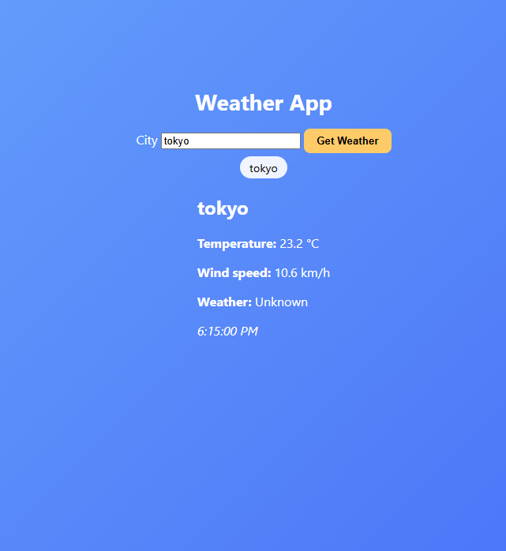
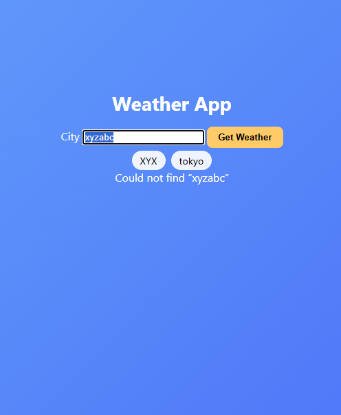

# Weather App  


A lightweight single-page JavaScript app that turns any city name into an instant weather snapshot using the **Open-Meteo** APIs.

---

## Features 💡

### 🌐 Core Functionality
- **City → Weather pipeline** – Geocodes the city via the *Open-Meteo Geocoding API*, then fetches real-time conditions from the *Forecast API* in one click.  
- **At-a-Glance Data** – Current **temperature (°C)**, **wind speed (km/h)** and a plain-language weather description.

### 🚦 Robust Error Handling
- Detects “city not found,” network time-outs and malformed responses.  
- Shows a single, easy-to-dismiss **error banner**—no duplicate messages.

### ✨ Advanced UX
- **Recent-Search Cache** – Stores up to five cities in `localStorage`; each appears as a clickable **chip** for one-tap re-query.

### 🎨 UI & Accessibility
- Centered, mobile-friendly Flexbox layout with a soft gradient background.  
- Live-region (`aria-live="polite"`) so screen-reader users hear updates instantly.  
- Hidden label & autofocus for keyboard accessibility.

### 🛠️ Code Quality & Testing
- Single ES-module (`app.js`) organized into storage, API, UI and controller helpers.  
- Browser-vs-Node guard lets tests import the file head-lessly.  
- **Vitest** suite (2 specs) covering happy-path parsing and error handling.

### 🔐 Security & Ethics
- Key-free endpoints—no secrets committed.  
- `npm audit` (run 2025-06-14) shows **0 high-severity** issues.  
- Portions refactored with ChatGPT-o3; all code reviewed and released under the MIT License (see `LICENSE`).

---

## Setup 🚀

```bash
git clone https://github.com/<your-username>/weather-app.git
cd weather-app
npm install          # installs live-server & vitest
npm start            # launches at http://127.0.0.1:<port>
```

### Running Tests
```bash
npm test             # Vitest – should report 2 passing specs
```

### Project Structure
```bash
weather-app/
├── css/style.css
├── js/app.js
├── screenshots/
│   ├── tokyo.png
│   └── error.png
├── __tests__/app.test.js
├── index.html
├── LICENSE
└── package.json
```
### Ideas for Future Work

* Add browser geolocation (auto-detect current city).
* Map weathercode to icon sprites for visual flair.
* Offline caching of the most recent successful responses.

### Screenshots




---

## 🙏 Thanks for Stopping By!

I appreciate you taking the time to explore this Weather App project. Happy coding!☀️
